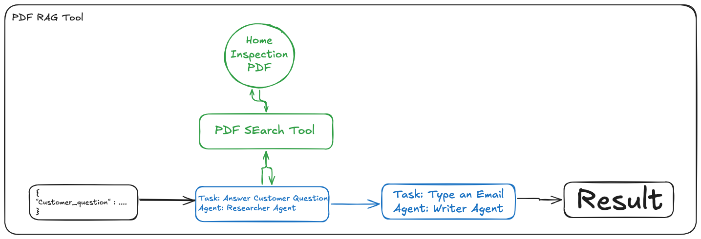

# Pdf Rag Crew



This “Home Inspection Crew” is a two‑stage, retrieval‑augmented pipeline that takes a customer’s question about a PDF inspection report and turns it into a ready‑to‑send email summary.  You begin by submitting a simple JSON payload—e.g.  
```json
{ "customer_question": "How does the electrical wiring look in this report?" }
```  
along with the Home Inspection PDF itself.  

First, the **Researcher Agent** invokes the **PDF Search Tool**, which under the hood embeds the entire PDF into a local vector store and runs similarity‑based retrieval whenever you ask a question.  That agent pulls out the exact passages—say, observations about wiring, breakers, grounding, etc.—that answer your query.  

Next, the **Writer Agent** takes those extracted insights and composes a clear, professional email describing what’s wrong (or what’s in spec) so you can forward it directly to your contractor.  In the end, you get a single, cohesive “Result” block: a polished email that both explains the findings and tells the contractor exactly what needs attention—all without you ever having to hunt through pages of PDF text yourself.