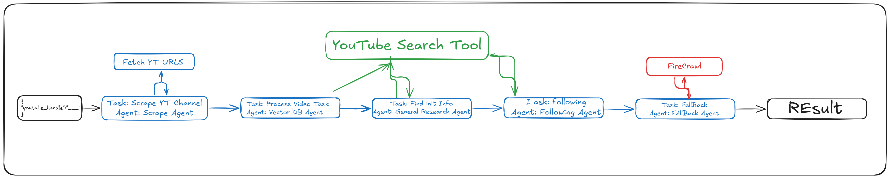

# YouTube Sponsership Crew

This project is an end‑to‑end, multi‑agent pipeline for automatically assembling rich sponsorship profiles on YouTube creators. Starting from nothing more than a simple JSON input with a youtube_handle, the “Scrape Agent” kicks off a custom YouTube‑scraper tool that crawls a channel’s page to pull its URL, channel ID, subscriber count, description and the URLs of its two most recent videos. That raw data then feeds into a “Vector DB Agent,” which normalizes and stores the channel and video URLs in a vector database—laying the groundwork for rapid lookups and similarity searches in later stages.

Once the initial scrape is complete, a “General Research Agent” leverages a YouTube search tool (and, where needed, a browser‑based lookup) to fill in any core metadata we couldn’t scrape—things like exact channel titles, niche categories or regional tags. Next comes the “Following Agent,” a focused follow‑up task that hunts down the remaining blanks: personal websites, LinkedIn/Twitter handles, contact emails or other social links. Finally, any stubbornly missing fields are passed to a “Fallback Agent” powered by FireCrawl, which applies deeper web‑scraping and site‑crawling heuristics to capture that last 10% of elusive data. The end result is a structured, near‑complete dossier on each YouTuber—ready for use in sponsorship outreach, marketing segmentation or personalized campaign automation.
