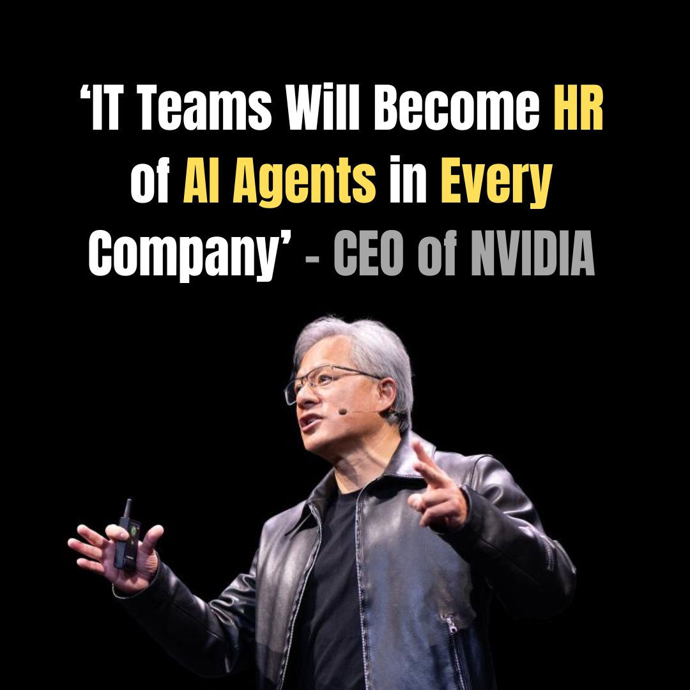

# Learn Agentic AI

## Watch The NVIDIA CEO Jensen Huang Keynote at CES 2025

Reference:

https://www.linkedin.com/posts/alexwang2911_aiagents-robotics-technology-activity-7282829390445453314-QLeS

# Comparative Analysis of Agentic AI Frameworks

In this report, we examine six prominent **agentic frameworks** – **LangGraph**, **CrewAI**, **AutoGen**, **OpenAI Agent SDK**, **Amazon Bedrock**, and **Agno (Phidata)** – comparing their philosophy, usability, flexibility, complexity management, collaboration features, scalability, and typical use cases. We also highlight recent growth trends, community adoption, and enterprise interest for each. The goal is to provide a clear understanding of each framework and how they stack up against one another.

### LangGraph
**Core Philosophy & Structure**  
A low‑level, graph‑based orchestrator where each node is an agent with its own state and tools. Edges define control flow and data passing, enabling precise, modular workflows.

**Ease of Use & Learning Curve**  
Moderate. Requires understanding graph paradigms and manual node/edge definitions. Familiarity with LangChain eases adoption.

**Flexibility & Customization**  
Very high. Arbitrary graph topologies, custom agent logic, multiple LLMs per node, and seamless tool integration.

**Complexity Handling**  
Excellent for multi‑step, conditional workflows. Explicit state management, branching, loops, retries, and human‑in‑the‑loop support.

**Collaboration & Teamwork**  
Supports multi‑agent coordination via graph connections. Developer defines interactions; no built‑in free‑form chat.

**Scalability & Robustness**  
Production‑proven (used by Replit, Uber, LinkedIn). Lightweight library; scaling and persistence left to implementer.

**Typical Use Cases**  
Enterprise workflows requiring strict control (e.g., compliance pipelines, multi‑stage report generation, human‑oversight automations).

---

### CrewAI
**Core Philosophy & Structure**  
Role‑based “crew” of specialized agents under a Crew coordinator. Optional Flows allow event‑driven orchestration on top of autonomous teamwork.

**Ease of Use & Learning Curve**  
High. Intuitive team/agent abstractions and extensive tutorials (DeepLearning.AI courses). Deeper features (Flows vs. Crews) take time to master.

**Flexibility & Customization**  
High. Mix autonomous Crews with scripted Flows, custom prompts, any LLM provider, and tool integrations.

**Complexity Handling**  
Built‑in memory (vector DB + SQLite), dynamic task delegation, conditional branching. Simplifies multi‑step, multi‑agent processes.

**Collaboration & Teamwork**  
Outstanding. Native multi‑agent communication, role delegation, shared memory, and emergent coordination patterns.

**Scalability & Robustness**  
Enterprise‑grade. Lightweight runtime, enterprise control plane for monitoring, on‑prem options, and proven at scale.

**Typical Use Cases**  
Business process automation with distinct roles (e.g., project planning teams, multi‑agent content pipelines, RPA replacements).

---

### AutoGen
**Core Philosophy & Structure**  
Chat‑based multi‑agent framework where agents (AI or human proxies) converse asynchronously. Optional “Commander” agent oversees group dialogues.

**Ease of Use & Learning Curve**  
High for basic setups—predefined agent types and no‑code GUI (AutoGen Studio). Advanced async patterns and custom agent creation require more learning.

**Flexibility & Customization**  
Very high. Free‑form or structured conversations, custom agent classes, pluggable memory, function‑calling tools, and human‑in‑the‑loop.

**Complexity Handling**  
Strong. Asynchronous, event‑driven architecture supports parallel dialogues, long‑running sessions, and rich observability (OpenTelemetry).

**Collaboration & Teamwork**  
Natural multi‑party chat. Agents negotiate, critique, and collaborate via shared conversation channels or hierarchical leader roles.

**Scalability & Robustness**  
Rapidly maturing. v0.4 redesign for async scalability, distributed operation support, active open‑source community.

**Typical Use Cases**  
Pair programming (coder + reviewer), AI brainstorming, simulated debates, research assistants with specialist sub‑agents.

---

### OpenAI Agent SDK
**Core Philosophy & Structure**  
Minimalist toolkit: each Agent is an LLM with a set of tools (including other agents). Orchestration via function‑call handoffs and ReAct‑style reasoning.

**Ease of Use & Learning Curve**  
Very easy. Few lines to instantiate agents and tools. Leverages familiar OpenAI API paradigms and provides built‑in tracing UI.

**Flexibility & Customization**  
Moderate. Custom tools and nested agents supported; complex workflows require developer‑defined chaining.

**Complexity Handling**  
Good for moderate multi‑step tasks. Guardrails enforce output validity; deep branching or large agent networks need extra code.

**Collaboration & Teamwork**  
Basic. Agent‑as‑tool handoffs enable hierarchical delegation. No built‑in free‑form multi‑agent chat.

**Scalability & Robustness**  
Production‑ready. Lightweight SDK, backed by OpenAI’s scalable APIs, with guardrails and tracing for safe deployment.

**Typical Use Cases**  
Tool‑augmented chatbots, research assistants (web/file retrieval), automated API workflows, voice‑enabled personal assistants.

---

### Amazon Bedrock
**Core Philosophy & Structure**  
Managed multi‑agent service with a Supervisor agent that delegates to specialized sub‑agents. AWS handles orchestration, security, and scaling.

**Ease of Use & Learning Curve**  
High for AWS users. Low‑code setup via console or CloudFormation. Integrated debug/trace console.

**Flexibility & Customization**  
Moderate. Choose foundation models, configure prompts and tools (via AWS Lambda), and select collaboration modes (supervisor vs. routing).

**Complexity Handling**  
Excellent. Built‑in task decomposition, parallel execution, optimized routing, and state/context management under the hood.

**Collaboration & Teamwork**  
Structured teamwork through Supervisor‑subagent paradigm. Agents communicate via the service, ensuring efficient coordination.

**Scalability & Robustness**  
Enterprise‑grade. Auto‑scaling, high availability, CloudWatch monitoring, and AWS SLAs deliver mission‑critical reliability.

**Typical Use Cases**  
Large‑scale enterprise workflows (loan processing, insurance claims), secure data‑sensitive pipelines, parallel document analysis.

---

### Agno (Phidata)
**Core Philosophy & Structure**  
Unified agent platform: wrap any LLM with memory, knowledge retrieval (RAG), tools, and native multimodal support. Optional Workflows for multi‑agent flows.

**Ease of Use & Learning Curve**  
Very high. Simple, Pythonic API (10–15 lines to create agents). Built‑in web UI (Playground) for interactive testing and monitoring.

**Flexibility & Customization**  
Very high. Swap models, vector stores, tools, and modalities (text, images, PDFs). Fully open‑source for deep customization.

**Complexity Handling**  
Strong. Persistent memory, RAG integration, structured outputs, and lightning‑fast agent instantiation for complex, long‑running tasks.

**Collaboration & Teamwork**  
Supported via Workflows or manual orchestration. Focus is on powerful single agents, though multi‑agent teams can be composed.

**Scalability & Robustness**  
High. Optimized for speed and low overhead—suitable for thousands of concurrent agents. Built‑in monitoring and open‑source reliability.

**Typical Use Cases**  
Multimodal research assistants, long‑term personal AI with memory, domain‑specific expert agents (legal, finance), large‑scale agent simulations.

---

## Comparison Matrix

| Dimension               | LangGraph      | CrewAI         | AutoGen        | OpenAI Agent SDK | Amazon Bedrock | Agno (Phidata) |
|-------------------------|----------------|----------------|----------------|------------------|----------------|----------------|
| **Philosophy**          | Graph workflows| Role‑based crews| Chat‑based     | Minimalist SDK   | Supervisor model | Unified multimodal |
| **Ease of Use**         | Moderate       | High           | High           | Very High        | High (AWS)     | Very High      |
| **Flexibility**         | Very High      | High           | Very High      | Moderate         | Moderate‑High  | Very High      |
| **Complexity Handling** | Excellent      | Excellent      | Strong         | Good             | Excellent      | Strong         |
| **Collaboration**       | Structured     | Outstanding    | Natural chat   | Basic handoffs   | Structured     | Supported      |
| **Scalability**         | User‑managed   | Enterprise‑grade| Maturing       | Production‑ready | AWS‑scale      | Highly efficient|
| **Use Case Fit**        | Enterprise     | Business teams | Brainstorming  | Tool bots        | Enterprise     | Multimodal agents |

## Use Case Highlights
- **Complex, Controlled Workflows**: LangGraph, Amazon Bedrock  
- **Structured Multi‑Agent Teams**: CrewAI  
- **Multi‑Agent Dialogue & Brainstorming**: AutoGen  
- **Rapid Tool‑Enabled Assistants**: OpenAI Agent SDK  
- **All‑in‑One Multimodal Agents**: Agno (Phidata)

## Conclusion
Each framework brings distinct strengths. Choose **LangGraph** or **Bedrock** for enterprise workflows with strict control, **CrewAI** for role‑based team automation, **AutoGen** for conversational multi‑agent scenarios, **OpenAI Agent SDK** for quick tool‑augmented prototypes, and **Agno** for a comprehensive, multimodal agent platform. Assess your project’s complexity, collaboration needs, and infrastructure to select the best fit.

---

<h2 align="center">Dear Brother and Sister Show some ❤ by  this repository!</h2>