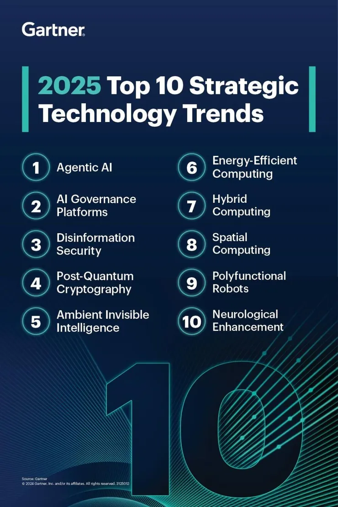

# Learn Agentic AI

## Watch The NVIDIA CEO Jensen Huang Keynote at CES 2025

Reference:

https://www.linkedin.com/posts/alexwang2911_aiagents-robotics-technology-activity-7282829390445453314-QLeS

# Comparative Analysis of Agentic AI Frameworks

In this report, we examine six prominent **agentic frameworks** – **LangGraph**, **CrewAI**, **AutoGen**, **OpenAI Agent SDK**, **Amazon Bedrock**, and **Agno (Phidata)** – comparing their philosophy, usability, flexibility, complexity management, collaboration features, scalability, and typical use cases. We also highlight recent growth trends, community adoption, and enterprise interest for each. The goal is to provide a clear understanding of each framework and how they stack up against one another.

### LangGraph
**Core Philosophy & Structure**  
A low‑level, graph‑based orchestrator where each node is an agent with its own state and tools. Edges define control flow and data passing, enabling precise, modular workflows.

**Ease of Use & Learning Curve**  
Moderate. Requires understanding graph paradigms and manual node/edge definitions. Familiarity with LangChain eases adoption.

**Flexibility & Customization**  
Very high. Arbitrary graph topologies, custom agent logic, multiple LLMs per node, and seamless tool integration.

**Complexity Handling**  
Excellent for multi‑step, conditional workflows. Explicit state management, branching, loops, retries, and human‑in‑the‑loop support.

**Collaboration & Teamwork**  
Supports multi‑agent coordination via graph connections. Developer defines interactions; no built‑in free‑form chat.

**Scalability & Robustness**  
Production‑proven (used by Replit, Uber, LinkedIn). Lightweight library; scaling and persistence left to implementer.

**Typical Use Cases**  
Enterprise workflows requiring strict control (e.g., compliance pipelines, multi‑stage report generation, human‑oversight automations).

---

### CrewAI
**Core Philosophy & Structure**  
Role‑based “crew” of specialized agents under a Crew coordinator. Optional Flows allow event‑driven orchestration on top of autonomous teamwork.

**Ease of Use & Learning Curve**  
High. Intuitive team/agent abstractions and extensive tutorials (DeepLearning.AI courses). Deeper features (Flows vs. Crews) take time to master.

**Flexibility & Customization**  
High. Mix autonomous Crews with scripted Flows, custom prompts, any LLM provider, and tool integrations.

**Complexity Handling**  
Built‑in memory (vector DB + SQLite), dynamic task delegation, conditional branching. Simplifies multi‑step, multi‑agent processes.

**Collaboration & Teamwork**  
Outstanding. Native multi‑agent communication, role delegation, shared memory, and emergent coordination patterns.

**Scalability & Robustness**  
Enterprise‑grade. Lightweight runtime, enterprise control plane for monitoring, on‑prem options, and proven at scale.

**Typical Use Cases**  
Business process automation with distinct roles (e.g., project planning teams, multi‑agent content pipelines, RPA replacements).

---

### AutoGen
**Core Philosophy & Structure**  
Chat‑based multi‑agent framework where agents (AI or human proxies) converse asynchronously. Optional “Commander” agent oversees group dialogues.

**Ease of Use & Learning Curve**  
High for basic setups—predefined agent types and no‑code GUI (AutoGen Studio). Advanced async patterns and custom agent creation require more learning.

**Flexibility & Customization**  
Very high. Free‑form or structured conversations, custom agent classes, pluggable memory, function‑calling tools, and human‑in‑the‑loop.

**Complexity Handling**  
Strong. Asynchronous, event‑driven architecture supports parallel dialogues, long‑running sessions, and rich observability (OpenTelemetry).

**Collaboration & Teamwork**  
Natural multi‑party chat. Agents negotiate, critique, and collaborate via shared conversation channels or hierarchical leader roles.

**Scalability & Robustness**  
Rapidly maturing. v0.4 redesign for async scalability, distributed operation support, active open‑source community.

**Typical Use Cases**  
Pair programming (coder + reviewer), AI brainstorming, simulated debates, research assistants with specialist sub‑agents.

---

### OpenAI Agent SDK
**Core Philosophy & Structure**  
Minimalist toolkit: each Agent is an LLM with a set of tools (including other agents). Orchestration via function‑call handoffs and ReAct‑style reasoning.

**Ease of Use & Learning Curve**  
Very easy. Few lines to instantiate agents and tools. Leverages familiar OpenAI API paradigms and provides built‑in tracing UI.

**Flexibility & Customization**  
Moderate. Custom tools and nested agents supported; complex workflows require developer‑defined chaining.

**Complexity Handling**  
Good for moderate multi‑step tasks. Guardrails enforce output validity; deep branching or large agent networks need extra code.

**Collaboration & Teamwork**  
Basic. Agent‑as‑tool handoffs enable hierarchical delegation. No built‑in free‑form multi‑agent chat.

**Scalability & Robustness**  
Production‑ready. Lightweight SDK, backed by OpenAI’s scalable APIs, with guardrails and tracing for safe deployment.

**Typical Use Cases**  
Tool‑augmented chatbots, research assistants (web/file retrieval), automated API workflows, voice‑enabled personal assistants.

---

### Amazon Bedrock
**Core Philosophy & Structure**  
Managed multi‑agent service with a Supervisor agent that delegates to specialized sub‑agents. AWS handles orchestration, security, and scaling.

**Ease of Use & Learning Curve**  
High for AWS users. Low‑code setup via console or CloudFormation. Integrated debug/trace console.

**Flexibility & Customization**  
Moderate. Choose foundation models, configure prompts and tools (via AWS Lambda), and select collaboration modes (supervisor vs. routing).

**Complexity Handling**  
Excellent. Built‑in task decomposition, parallel execution, optimized routing, and state/context management under the hood.

**Collaboration & Teamwork**  
Structured teamwork through Supervisor‑subagent paradigm. Agents communicate via the service, ensuring efficient coordination.

**Scalability & Robustness**  
Enterprise‑grade. Auto‑scaling, high availability, CloudWatch monitoring, and AWS SLAs deliver mission‑critical reliability.

**Typical Use Cases**  
Large‑scale enterprise workflows (loan processing, insurance claims), secure data‑sensitive pipelines, parallel document analysis.

---

### Agno (Phidata)
**Core Philosophy & Structure**  
Unified agent platform: wrap any LLM with memory, knowledge retrieval (RAG), tools, and native multimodal support. Optional Workflows for multi‑agent flows.

**Ease of Use & Learning Curve**  
Very high. Simple, Pythonic API (10–15 lines to create agents). Built‑in web UI (Playground) for interactive testing and monitoring.

**Flexibility & Customization**  
Very high. Swap models, vector stores, tools, and modalities (text, images, PDFs). Fully open‑source for deep customization.

**Complexity Handling**  
Strong. Persistent memory, RAG integration, structured outputs, and lightning‑fast agent instantiation for complex, long‑running tasks.

**Collaboration & Teamwork**  
Supported via Workflows or manual orchestration. Focus is on powerful single agents, though multi‑agent teams can be composed.

**Scalability & Robustness**  
High. Optimized for speed and low overhead—suitable for thousands of concurrent agents. Built‑in monitoring and open‑source reliability.

**Typical Use Cases**  
Multimodal research assistants, long‑term personal AI with memory, domain‑specific expert agents (legal, finance), large‑scale agent simulations.

---

## Adoption and Community Trends

All these frameworks emerged from the post-2023 surge in interest for autonomous agents and have seen **rapid growth and community adoption**. Several have garnered significant attention on GitHub, indicating developer interest:

- **[AutoGen (Microsoft)](https://github.com/microsoft/autogen)** – as of early 2025, AutoGen leads in GitHub traction with ~43k stars. This reflects the strong backing of Microsoft Research and the appeal of its multi-agent conversation approach. An active Discord community and continuous improvements (v0.4 redesign) show ongoing developer engagement. Many developers likely use AutoGen for its robust features, and Microsoft’s promotion of it in research circles has spurred adoption in experimental projects and enterprise prototypes.

- **[CrewAI](https://github.com/crewAIInc/crewAI)** – not far behind, CrewAI has around 30k stars and a vibrant community. The fact that 100k+ developers have taken CrewAI courses demonstrates a deliberate community-building effort. It’s becoming a “standard” for multi-agent automation in some circles, especially for those prioritizing structured collaboration. Enterprise interest is high: CrewAI’s team offers an enterprise suite and has partnerships (e.g., with SambaNova for AI hardware integration), indicating that companies are exploring it for production. The presence of CrewAI in educational content (DeepLearning.AI courses, government tech notes ) has also fueled its adoption.

- **[Agno (Phidata)](https://github.com/agno-agi/agno)** – Agno has about 24k stars, impressive for an open-source project that isn’t backed by a tech giant. This popularity likely stems from its comprehensive feature set and developer-friendly design. The community forum and Discord show an engaged user base. Agno’s comparative benchmarks boasting vastly faster performance than LangGraph have been shared widely, attracting developers concerned with efficiency. We also see many YouTube tutorials and Medium articles about building agents with Agno, indicating grass-roots enthusiasm and growing adoption among indie developers and startups. Enterprises that need on-prem solutions might lean towards Agno for its open-source nature combined with rich capabilities.

- **[LangGraph](https://github.com/langchain-ai/langgraph)** – with ~11k stars, LangGraph has a solid but more niche following, partly because it’s tied to LangChain. It’s used by big names like Uber and LinkedIn which speaks to enterprise adoption in complex projects requiring control. However, some developers might opt for LangChain’s higher-level agents if they don’t need LangGraph’s granular control, so its adoption is concentrated among those tackling truly complex workflows. The LangChain ecosystem’s popularity gave LangGraph an initial boost, and it continues to be maintained as a crucial part of that ecosystem. It’s recognized as a more **“expert-friendly”** tool, so its community, while smaller, is quite specialized and passionate about robust agent design.

- **[OpenAI Agent SDK](https://github.com/openai/openai-agents-python)** – relatively new on the scene, it has ~8k stars on GitHub but is rapidly growing. Being the official OpenAI solution, many developers are trying it out, and we can expect its adoption to increase quickly through 2025. OpenAI’s release of the Agent SDK in March 2025 came with a lot of publicity (e.g., a VentureBeat article touted it as a game-changer for enterprise). Early adopters include companies like Coinbase and Box (through partnerships) which were mentioned in OpenAI’s announcements. The developer community is actively comparing it with existing tools – for example, discussions like  [*“OpenAI Agent SDK vs LangGraph”* on Reddit](https://www.reddit.com/r/LangChain/comments/1j95uat/openai_agent_sdk_vs_langgraph/) highlight how people are evaluating its place in the ecosystem. Its usage is also tied to OpenAI’s broader platform (e.g., those using GPT-4 via API can easily add the Agent SDK), which will drive adoption among OpenAI’s customer base. The OpenAI brand and promise of seamless integration are strong draws for both individual developers and enterprises (especially those already using Azure OpenAI or OpenAI API services).

- **[Amazon Bedrock](https://aws.amazon.com/blogs/machine-learning/amazon-bedrock-announces-general-availability-of-multi-agent-collaboration/)** – since Bedrock Agents is a managed service, it’s not reflected in GitHub stats, but AWS reports high interest from enterprises. Bedrock’s multi-agent feature became generally available in late 2024, and AWS has been onboarding customers in finance, healthcare, and retail sectors who want to leverage multi-agent AI without building from scratch. Public interest is evidenced by coverage in AWS re:Invent keynotes and blogs. There’s also a growing discussion in AI communities about Bedrock’s approach (e.g., [*“Anyone using Bedrock for AI agents?”* on Reddit](https://medium.com/@awaisshaikh94/building-ai-agents-using-amazon-bedrock-agents-5de9ce0b23a3)). It might not be widely used by hobbyists due to cost and access, but large AWS customers are experimenting with it. We can foresee Bedrock’s adoption growing as success stories emerge, particularly for large-scale and compliance-sensitive deployments that trust AWS. Amazon’s entry validated the multi-agent concept for enterprise, increasing overall industry confidence in these frameworks.

Community size and support vary: CrewAI and Agno have dedicated forums and Discords, indicating strong grassroots communities. AutoGen benefits from Microsoft’s support plus an academic following (papers and MSR blog posts). LangGraph benefits from LangChain’s large community (LangChain’s Discord/forums have channels for LangGraph). OpenAI’s Agents likely will be discussed heavily on OpenAI’s forums and community channels. Amazon Bedrock’s community is more enterprise/solution-architect oriented, with AWS support channels and partner ecosystem (it’s discussed in AWS community events, LinkedIn posts by AWS partners, etc., rather than open-source circles).

Overall, interest in agentic frameworks is **surging across the board**, and each of these tools has carved out a niche: 
- AutoGen for multi-agent dialogues and research,
- CrewAI for structured multi-agent teams in production,
- LangGraph for fine-grained control in complex tasks,
- OpenAI SDK for ease of integration and official support,
- Bedrock for fully managed enterprise solutions,
- Agno for an all-in-one open platform with performance and multimodality.

---

## Comparison Matrix

| Dimension               | LangGraph      | CrewAI         | AutoGen        | OpenAI Agent SDK | Amazon Bedrock | Agno (Phidata) |
|-------------------------|----------------|----------------|----------------|------------------|----------------|----------------|
| **Philosophy**          | Graph workflows| Role‑based crews| Chat‑based     | Minimalist SDK   | Supervisor model | Unified multimodal |
| **Ease of Use**         | Moderate       | High           | High           | Very High        | High (AWS)     | Very High      |
| **Flexibility**         | Very High      | High           | Very High      | Moderate         | Moderate‑High  | Very High      |
| **Complexity Handling** | Excellent      | Excellent      | Strong         | Good             | Excellent      | Strong         |
| **Collaboration**       | Structured     | Outstanding    | Natural chat   | Basic handoffs   | Structured     | Supported      |
| **Scalability**         | User‑managed   | Enterprise‑grade| Maturing       | Production‑ready | AWS‑scale      | Highly efficient|
| **Use Case Fit**        | Enterprise     | Business teams | Brainstorming  | Tool bots        | Enterprise     | Multimodal agents |

## Use Case Highlights
- **Complex, Controlled Workflows**: LangGraph, Amazon Bedrock  
- **Structured Multi‑Agent Teams**: CrewAI  
- **Multi‑Agent Dialogue & Brainstorming**: AutoGen  
- **Rapid Tool‑Enabled Assistants**: OpenAI Agent SDK  
- **All‑in‑One Multimodal Agents**: Agno (Phidata)

## Conclusion
Each framework brings distinct strengths. Choose **LangGraph** or **Bedrock** for enterprise workflows with strict control, **CrewAI** for role‑based team automation, **AutoGen** for conversational multi‑agent scenarios, **OpenAI Agent SDK** for quick tool‑augmented prototypes, and **Agno** for a comprehensive, multimodal agent platform. Assess your project’s complexity, collaboration needs, and infrastructure to select the best fit.

---

<h2 align="center">Dear Brother and Sister Show some ❤ by  this repository!</h2>